<p align="center">
  
</p>

<h1 align="center">Quits</h1>

<p align="center">
  <strong>Split costs with friends. Settle up in the fewest payments.</strong><br>
  A React Native app for iOS, Android and the web.
</p>

<p align="center">
  <a href="https://ahmadbasraa818.github.io/quits/"><strong>Try the live demo</strong></a>
  ·
  <a href="#the-fewest-payments">How it settles up</a>
  ·
  <a href="docs/ARCHITECTURE.md">Architecture</a>
</p>

<p align="center">
  <a href="https://github.com/ahmadbasraa818/quits/actions/workflows/ci.yml"></a>
  
  
  
</p>

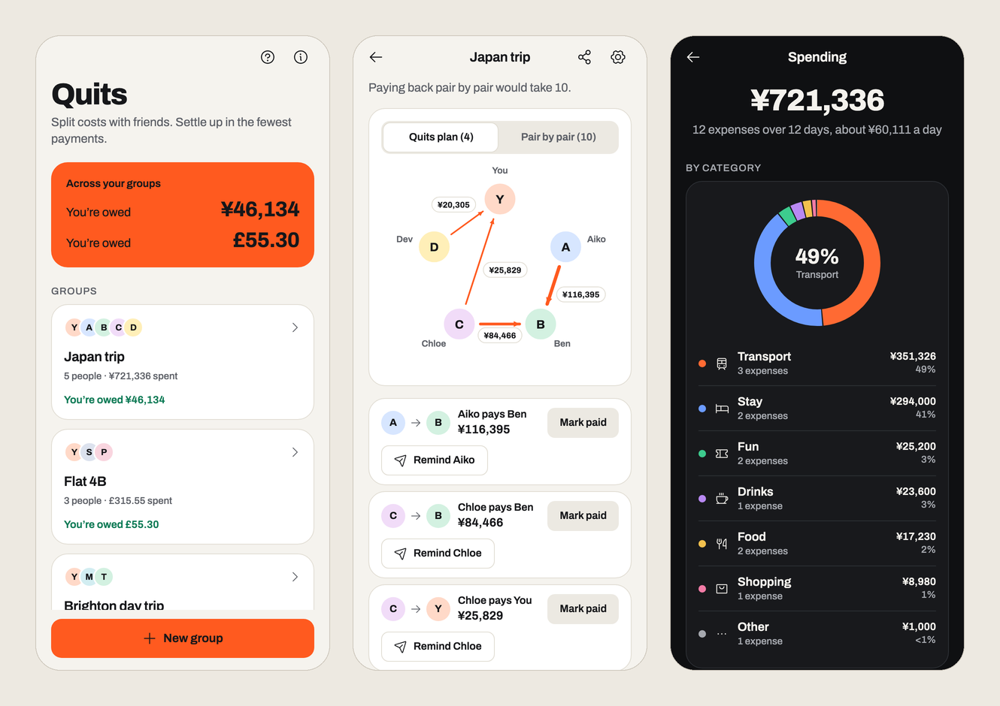

Quits keeps a running score of who paid for what on a trip, in a flat or on a night out, then works out the fewest payments that make everyone square. One TypeScript codebase runs it on iOS, Android and the web. It works offline, and your groups stay on your device: there is no server.

## Highlights

- **Provably the fewest payments.** A dynamic program over every subset of people finds the true minimum, not a greedy guess, and the app explains why the plan can't be shorter. [How it works](#the-fewest-payments)
- **Exact to the penny, in any currency.** Money is held in integers and split by the largest remainder method, and currencies are converted in BigInt at the European Central Bank's rate for the day. [How it works](#fair-to-the-penny)
- **Type it as you'd say it.** "Ramen ¥4,800, Aiko paid, split with Ben and me" becomes an expense. A small scanner reads it: instant, offline and fully tested. [How it works](#quick-add)
- **Shared without a server.** A whole group fits in a link, after the `#`, where no server ever sees it. [How it works](#sharing-without-a-server)
- **An app on the web too.** Install it from the browser and it opens offline. On a wide screen, the groups sit in a sidebar.
- **Tested like it matters.** 404 unit, property and component tests and 106 end-to-end runs with accessibility scans. CI deploys the demo only when everything passes. [Quality](#quality)

## What it does

**Add what everyone paid**

- **Quick add:** type an expense as you'd say it, and see what Quits understood as you type, with anything it assumed marked before you save.
- **Split any way:** equally, by shares, by exact amounts, or item by item, with tax, service and tip shared in proportion to what everyone had. Every split adds up to the penny.
- **Sums in any amount field:** “4800÷3” is ¥1,600, worked out exactly, with + − × ÷ keys for phones.
- **Any of 33 currencies:** each expense can be in its own currency, converted at the ECB's rate for its date or at a rate you type, fixed when you save it.
- **Dated and noted:** pick the day from a calendar and add a note, change anything later, and undo a delete.
- **Bills that come back:** rent, a subscription or a weekly shop can repeat every week, month or year. Quits adds each one on the day it's due, even after time away, and a monthly bill on the 31st comes back on the last day of a shorter month.

**Settle up**

- **In the fewest payments.** The demo's five-person Japan trip settles in 4 payments instead of the 10 it would take pair by pair. Switch between the two and the arrows redraw, so you watch the saving happen.
- **Record payments as they happen:** a whole payment with a tap, part of one, or one made outside the plan, with a history you can undo. Share the plan with the group as a message.
- **Pay in a tap.** Add how anyone gets paid (PayPal, Monzo, Revolut, Venmo, Cash App or any pay link), and whoever owes them gets a button that opens the service, in its app where it's installed, with the amount filled in where the service allows: PayPal in the currencies it takes, Monzo in pounds and Venmo in US dollars. A pasted link works as well as a username.
- **Remind, kindly.** Remind sends whoever owes a friendly message with what they owe and the links to pay, through the share sheet, and Quits remembers when you last did. The shared plan carries the links too, and so does a shared copy of the group.
- **Feel it on a phone:** a light tap for each press and a firmer one when a payment or an expense is saved, which can be turned off.

**See where the money went**

- **Balances** as bars either side of zero.
- **Why do I owe this?** Tap anyone in Balances for every expense and payment behind their balance, line by line, adding up exactly.
- **Spending** by category, a timeline by day, week or month, and who paid against who used.
- **Find anything:** search expenses and their notes, ignoring case and accents, or narrow the list to a category.

**Your data, on your devices**

- **Share a copy by link.** Friends open their own copy and pick which person they are. Share again to send an update.
- **Back up every group to a file** and restore it on any device: a download on the web, the share sheet on a phone.
- **Export a group as a spreadsheet:** a CSV file of every expense and payment, with a column per person for what each did to their balance, adding up to where everyone stands.
- **Safe by default.** Saved data Quits can't read is set aside, never written over; a browser that won't save says so and offers a backup; and if a screen ever breaks, it offers a way out instead of a blank page.
- **Private by design**, with no account, server, analytics or tracking. The [privacy page](https://ahmadbasraa818.github.io/quits/privacy) says exactly when anything leaves the device.
- **Groups for anything:** rename them, add people, mark who has left, archive a finished one out of the list and totals, or delete one and undo it. The demo groups can be reset, or cleared away when you're ready, without touching your own.

**Help when you need it**

- **A help centre you can search**, with a “?” beside the trickier parts that opens the answer, and “Show me” buttons that open the right screen in the right state.
- **A welcome for anyone new**, and a note on what's new after each update.
- **Keyboard shortcuts** on a computer: N adds an expense, Q is quick add, / searches and ? opens help.

**Everywhere**

- **Install it from the browser** and it opens without a connection.
- **On a wide screen** your groups stay in a sidebar beside whatever's open.
- **Light and dark themes**, reduced motion respected, and screen-reader labels throughout.

<p align="center">
  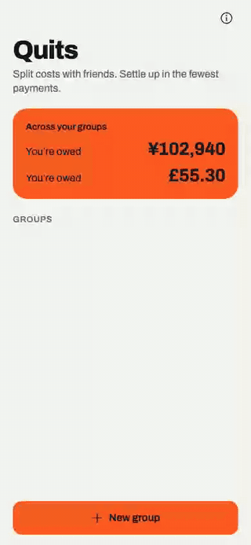
</p>

## Screens

The screenshots follow your GitHub theme. They're made from the web build by [`scripts/capture.mjs`](scripts/capture.mjs), so they always show the current app.

<table>
  <tr>
    <td align="center" width="33%">
      <picture>
        <source media="(prefers-color-scheme: dark)" srcset="docs/dark-add.png">
        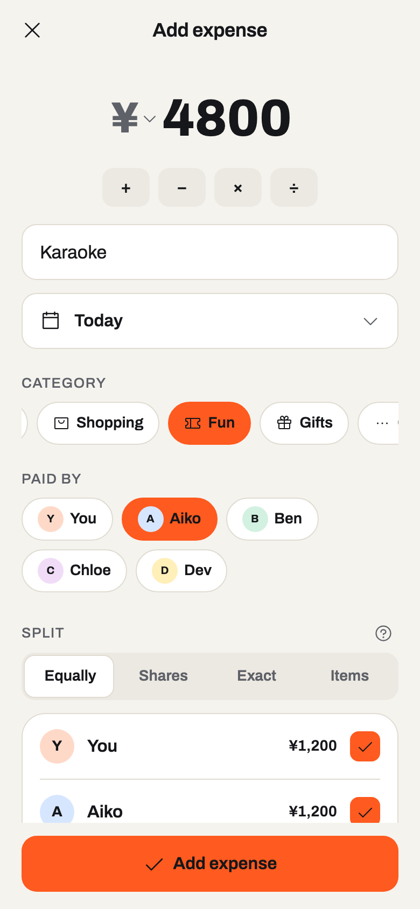
      </picture>
      <br><sub><b>Add an expense</b>, with sums in the amount</sub>
    </td>
    <td align="center" width="33%">
      <picture>
        <source media="(prefers-color-scheme: dark)" srcset="docs/dark-quick.png">
        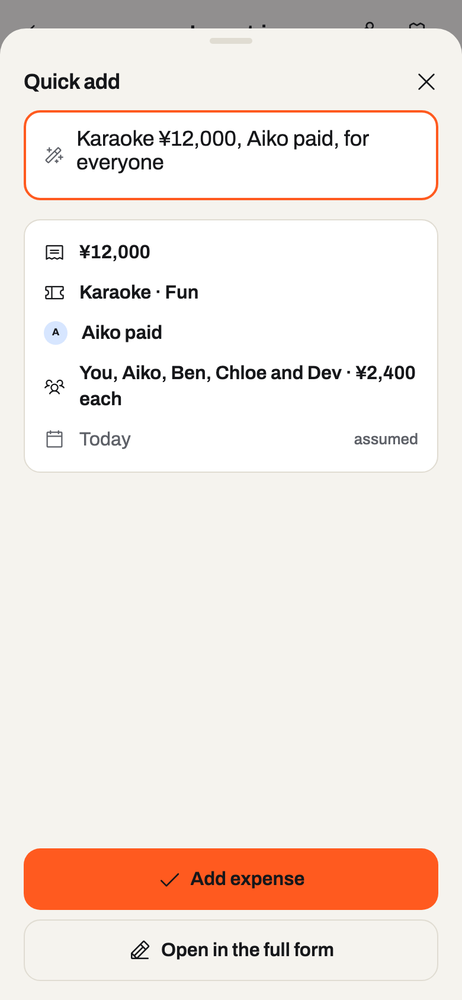
      </picture>
      <br><sub><b>Quick add</b> reads a sentence</sub>
    </td>
    <td align="center" width="33%">
      <picture>
        <source media="(prefers-color-scheme: dark)" srcset="docs/dark-items.png">
        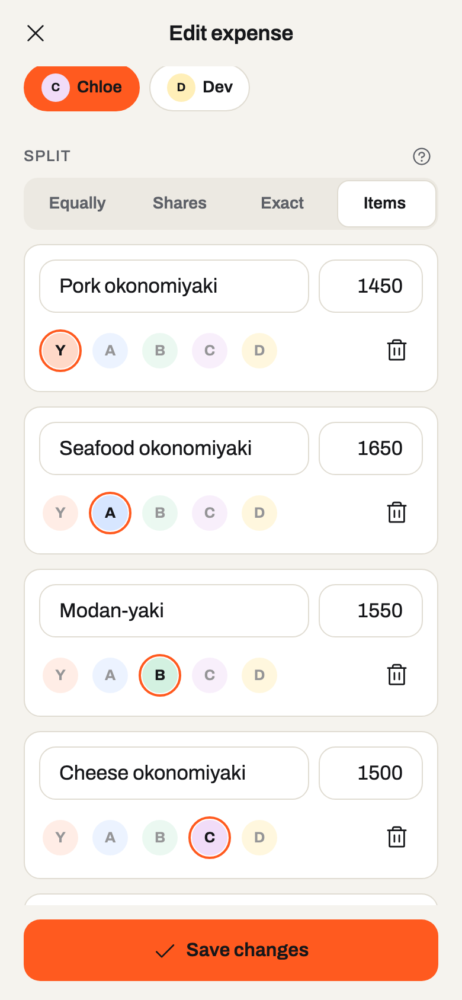
      </picture>
      <br><sub><b>Item by item</b>, for the bill at dinner</sub>
    </td>
  </tr>
  <tr>
    <td align="center">
      <picture>
        <source media="(prefers-color-scheme: dark)" srcset="docs/dark-balances.png">
        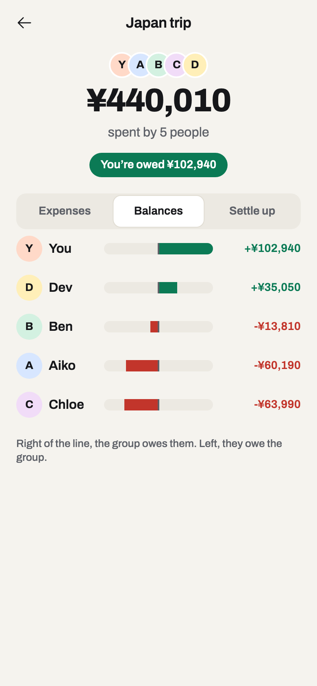
      </picture>
      <br><sub><b>Balances</b> either side of zero</sub>
    </td>
    <td align="center">
      <picture>
        <source media="(prefers-color-scheme: dark)" srcset="docs/dark-statement.png">
        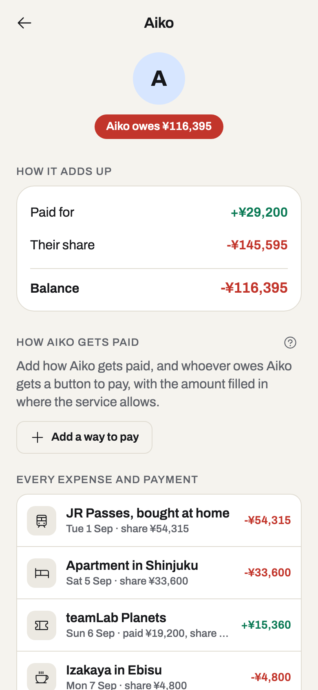
      </picture>
      <br><sub><b>Why do I owe this?</b> Every line</sub>
    </td>
    <td align="center">
      <picture>
        <source media="(prefers-color-scheme: dark)" srcset="docs/dark-spending.png">
        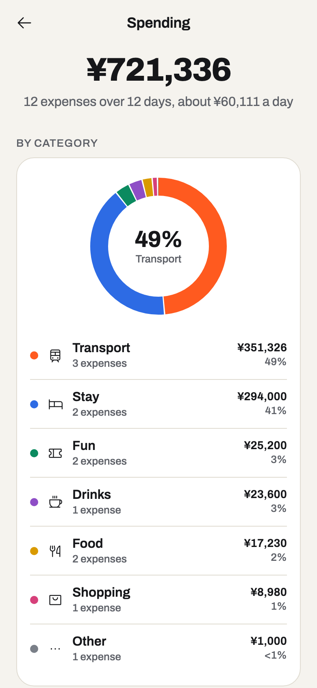
      </picture>
      <br><sub><b>Spending</b> by category and over time</sub>
    </td>
  </tr>
  <tr>
    <td align="center">
      <picture>
        <source media="(prefers-color-scheme: dark)" srcset="docs/dark-pay.png">
        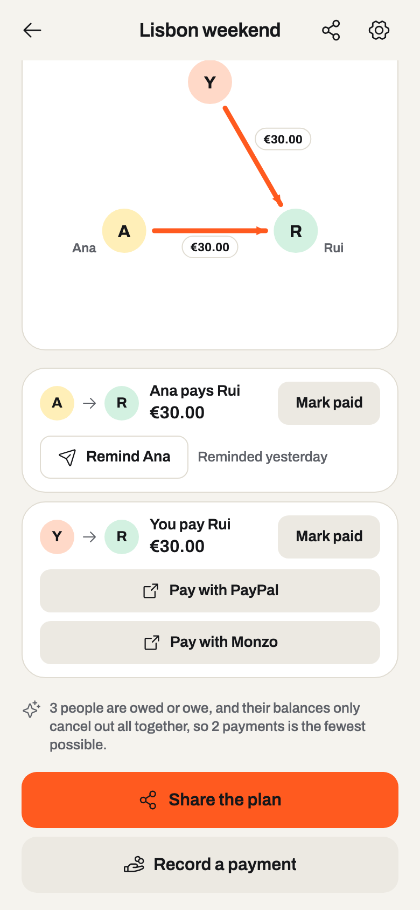
      </picture>
      <br><sub><b>Pay in a tap</b>, or send a reminder</sub>
    </td>
    <td align="center">
      <picture>
        <source media="(prefers-color-scheme: dark)" srcset="docs/dark-repeat.png">
        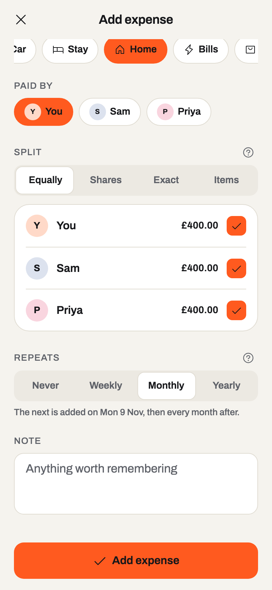
      </picture>
      <br><sub><b>Bills that come back</b> every month</sub>
    </td>
    <td align="center">
      <picture>
        <source media="(prefers-color-scheme: dark)" srcset="docs/dark-help.png">
        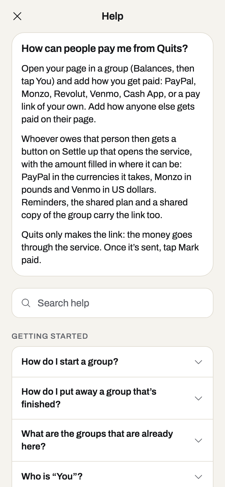
      </picture>
      <br><sub><b>Help</b>, with the answer asked for first</sub>
    </td>
  </tr>
</table>

<picture>
  <source media="(prefers-color-scheme: dark)" srcset="docs/dark-desktop.png">
  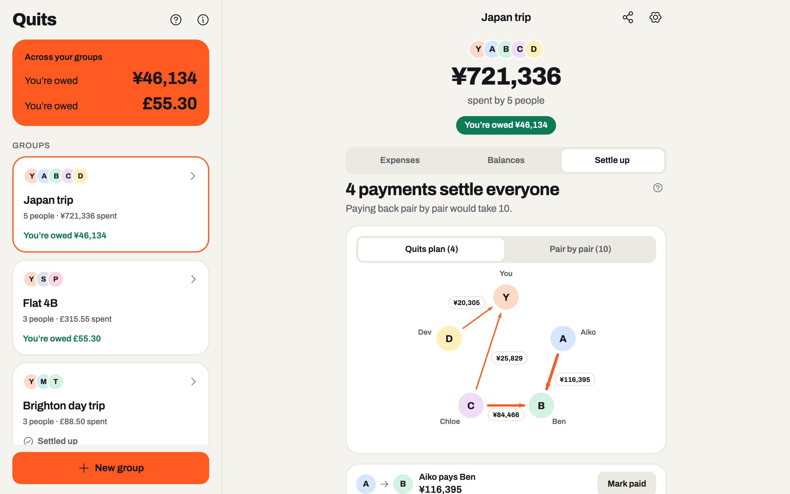
</picture>
<p align="center"><sub>On a wide screen the groups stay in a sidebar beside whatever's open.</sub></p>

## The fewest payments

After a trip, the obvious way to square up is pair by pair: everyone pays back each person who paid for them. That can take far more transfers than needed. Finding the true minimum is NP-hard in general, so most apps settle for a greedy match. Quits finds the exact answer for any realistic group.

The insight: if the people who are owed or owe can be split into *k* circles whose balances each add up to zero, they can settle in *n − k* payments, and never in fewer. So the job is to find the most zero-sum circles. [`src/lib/settle.ts`](src/lib/settle.ts) does that with a dynamic program over every subset of people:

- `groups[mask]` is the most zero-sum circles among the people in `mask`, taken in some order. It is the best over each person `i` of `groups[mask without i]`, plus one if `mask` itself sums to zero.
- Walking back from the full set recovers an order in which the running total returns to zero at the end of each circle. Each circle then settles in one payment fewer than its size.
- That is O(2ⁿ · n): instant for up to 16 people with an open balance. Larger groups fall back to matching the largest debtor with the largest creditor.
- The circles it finds are reported along with the payments, so the app can explain the count: “Their balances cancel out in 2 separate circles: Aiko and Ben; Chloe, Dev and you.”

It is checked, not just argued. Property tests (fast-check) generate hundreds of random groups with every kind of split and confirm, for each one, that the payments clear every balance, use no more than greedy matching, and match an independent backtracking search for the true minimum. One fixed case shows the difference: greedy needs 4 payments where Quits needs 3.

The diagram that draws the plan places each amount beside its arrow. [`placeLabels`](src/lib/graph-layout.ts) tries spots on both sides of the arrow and along it, and keeps the one that covers least: the edge of the drawing, the people, their names, the amounts already placed and the other arrows. Tests check the demo's plans at phone and desktop widths, where every amount covers nothing.

## Fair to the penny

- Money is held as whole minor units (pence, cents, yen), so totals never pick up floating-point error.
- When a bill won’t divide evenly, the leftover units go to the largest fractional parts, using the largest remainder method. £10 between three people is £3.34, £3.33 and £3.33, never £9.99 or £10.01. Property tests confirm that every split adds up exactly and that no one is ever more than a unit from their fair share.
- Amounts are parsed from what people type without ever going through floating point, and each currency keeps its own number of decimals: yen has none. The decimal comma works too, so “12,50” is twelve fifty and “1,250” is one thousand two hundred and fifty.
- An itemised bill splits each item between whoever had it. Tax, service and tip are then shared in proportion to what everyone had: £28.00 of food with £2.80 of service gives £14.50, £11.50 and £2.00 of food £1.45, £1.15 and £0.20. That's one largest-remainder division of the whole bill by each person's items.
- A sum typed into an amount field (“12.50 + 3.20 × 2”, “4800÷3”) is worked out in exact fractions, brackets and all, and rounded once to the smallest unit, so “0.1+0.2” is exactly 30p.

## Quick add

[`parseQuickAdd`](src/lib/quick-add.ts) reads a sentence into an expense. It's a small scanner rather than a language model, so it's instant, works offline, and every case can be tested.

- **What it does:**
  - It folds the text (lower case, no accents) code point by code point, so positions line up with the original.
  - It splits the text into words, numbers, currency symbols and punctuation.
  - It claims what it recognises in order: dates first (so "3 days ago" isn't an amount), then the amount, who paid, and who shared.
- **What it reads:**
  - **Dates:** "last night", "on Friday", "5 Sep", "12th of September".
  - **Amounts:** "¥4,800", "30 euros", "2.5k yen", "23,40 €", "A$45".
  - **Who paid:** "Aiko paid", "paid by Ben", "drinks on me", "I got it".
  - **Who shared:** "with Ben and me", "between Aiko, Ben & Chloe", "for everyone except Dev", "just Aiko".
- **How names are matched:** by full name, unique first name, or a unique start of one ("chlo" is Chloe). A list of common words is never read as a name, so "the" isn't Theo. A capitalised word in a name's place that matches no one is reported ("Bob isn't in Japan trip") rather than guessed.
- **The rest:** what's left, trimmed of the joining words, is the description, and a keyword in it suggests the category. Anything the sentence doesn't say falls back to the form's defaults, and the preview marks it "assumed".
- **Tests:** a table of 20 sentences, plus a property that generates sentences in four phrasings from random amounts, payers and lists of people, and checks every field comes back.

## Exact currency conversion

The demo trip keeps its books in yen, but the JR Passes were bought at home: £1,310.00 at £1 = ¥207.31.

- Rates are stored as decimal strings, exactly as the ECB publishes them or as you typed them, never as floats. Each is kept the way round that reads above one, so it's "£1 = ¥207.31", not "¥1 = £0.0048237".
- [`convert`](src/lib/fx.ts) multiplies whole numbers in BigInt and rounds once, half up. £1,310.00 × 207.31 is exactly ¥271,576.10, so ¥271,576.
- The split is worked out in the currency that was paid. The converted total is then divided in the same proportions with the largest remainder method, so the shares add up to the yen exactly. That proportional division can multiply two large amounts past 2^53, so `allocate` switches to BigInt there. A property test found that case.
- Rates come from the ECB through [Frankfurter](https://frankfurter.dev): free, keyless, and open to any website. On a weekend the reply carries Friday's rate and says so. Without a connection, or for the three currencies the ECB doesn't cover, you type the rate, and Quits reads it back ("£1 = ₫33,000") so a thousands comma can't quietly become a decimal point. Looked-up rates are kept, since a past day's rate never changes.
- Version 2 of the saved data added the JR Passes to the demo. [A migration](src/store/migrations.ts) gives returning visitors the new demo only if they never changed theirs.

## Sharing without a server

Quits has no backend: groups live on the device. To share one, [`shareLink`](src/lib/share-link.ts) packs the whole group into the link itself.

<table>
  <tr>
    <td align="center" width="50%">
      <picture>
        <source media="(prefers-color-scheme: dark)" srcset="docs/dark-share.png">
        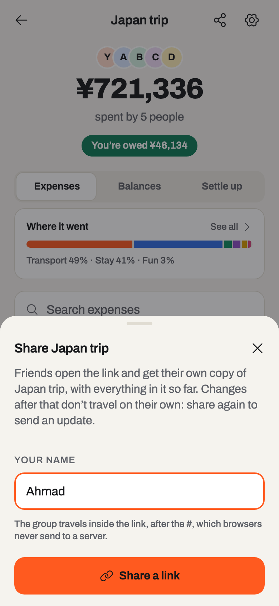
      </picture>
      <br><sub><b>Sharing</b> the trip as Ahmad</sub>
    </td>
    <td align="center" width="50%">
      <picture>
        <source media="(prefers-color-scheme: dark)" srcset="docs/dark-import.png">
        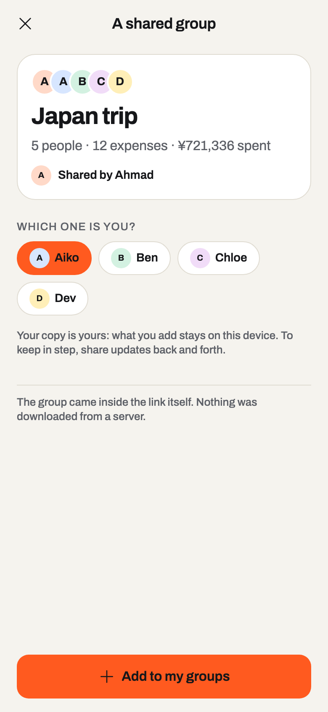
      </picture>
      <br><sub><b>Opening</b> it as Aiko, in another browser</sub>
    </td>
  </tr>
</table>

- **Packing:** the group's JSON is deflated with fflate and written in URL-safe base64 after a format marker. The Japan trip, all twelve expenses and five people, comes to a link under 4,000 characters.
- **Privacy:** the group sits after the `#`, which browsers never send to a server. GitHub Pages only ever sees `/quits/import`.
- **Opening a link:** the receiver says which person they are and gets a copy of their own.
- **Recognising copies:** a group gets a random origin id the first time it's shared, and copies carry it. Opening a newer link updates the copy instead of duplicating it. Ids alone wouldn't do, because every visitor's demo trip is `demo_japan`; that was caught by an end-to-end test where a friend with the demo opened the sharer's link.
- **Safety:** nothing from outside is trusted. Links unpack a piece at a time and stop at a size limit, so a crafted link can't expand without bound. [`validateGroup`](src/lib/validate.ts) then checks every field's type and range, that splits only name people in the group, and that "you" is one of them, before anything is saved.
- **Pay links:** how people get paid travels with the group, so a link from outside could carry anything. [`parsePayMethod`](src/lib/pay.ts) keeps a username to letters, digits, dots, dashes and underscores, and any other pay link to https with nothing that could end the link early. A way to pay from outside must already be in exactly that form, so a crafted group can't make a button that runs a script or opens anything but https.
- **Backups:** these are JSON files with a version. Restoring one runs the same migrations and checks as everything else.

## How it’s built

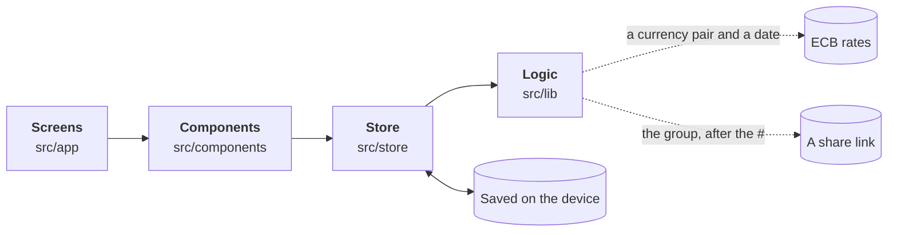

Each layer can use any layer below it, never one above. The logic in `src/lib` has no React in it, so the arithmetic that matters (money, splits, balances, settling up, conversion, parsing) is tested directly, and the screens stay thin. [docs/ARCHITECTURE.md](docs/ARCHITECTURE.md) goes through the layers and the decisions behind them.

| | |
|---|---|
| App | Expo SDK 57, React Native 0.86 and React 19, with the React Compiler; one codebase for iOS, Android and the web |
| Navigation | Expo Router with typed routes; modal screens for adding and editing; from 960 points wide, the groups in a sidebar beside the stack |
| State | Zustand, persisted with AsyncStorage and migrated between versions. On the web it falls back to memory if the browser blocks storage, so the demo still works when embedded in another site. |
| Motion | Reanimated 4: the settle-up graph redrawing, charts growing in, sliding tab marker, list layout transitions and press feedback, all off when the system asks for reduced motion |
| Gestures | React Native Gesture Handler: swipe an expense to delete it |
| Graphics | react-native-svg for the settle-up graph and the charts, and a generated subset of Phosphor icons (51 of them, not the whole set) |
| Files | fflate for share links; expo-file-system, expo-sharing and expo-document-picker for backups on phones, a download and the file picker on the web |
| Web app | A manifest and a service worker written at build time: it keeps every file of the current version, keyed by a hash of their contents, serves pages from the network first so a deploy shows at once, and opens the kept copy offline |
| Type | Archivo, loaded per weight |

```
src/
  app/          screens: the groups, a group, an expense, a person's statement, spending, settings,
                import, help, about and privacy
  components/   sheets, charts, the settle-up graph, the item editor, quick add, pay links, toasts, haptics
  lib/          the logic, with no React in it: money, splits, balances, settling up, conversion,
                quick add, sums, share links, pay links, repeats, spreadsheets, help, validation
                and the graph's layout
  store/        the persisted store, settings, migrations, backups, the demo data and cached rates
  theme/        colours for light and dark, type and spacing
e2e/            Playwright tests against the web build
scripts/        icons, the web export and its service worker, screenshots
```

## Quality

- **404 unit, property and component tests** with Jest, React Native Testing Library and fast-check, covering the logic, the store and the components.
- **106 end-to-end runs** with Playwright, on a phone-sized and a desktop browser, against the real web build served as GitHub Pages serves it. They:
  - add, edit, delete and undo; date an expense; create, edit and delete groups;
  - settle a whole group, watching the graph redraw; record part of a payment and delete one; share the plan through the clipboard;
  - read the spending charts and a person’s statement; search and filter;
  - add an expense by sentence and hand one to the full form; split an itemised bill with service; type a sum;
  - pay in euros at a served ECB rate, in đồng at a typed rate, and without a connection;
  - share a copy to a second, empty browser that opens it as another person; save and restore a backup;
  - keep the groups beside the open one on a wide screen; open the app offline from the service worker's copy; follow a deep link;
  - set aside saved data that can't be read, open the sound groups beside a damaged one, and warn when the browser won't save;
  - search the help and follow an answer to the right screen, open an answer from a “?”, welcome someone new, tell someone back after an update what's new once, and drive a group from the keyboard;
  - reset or remove the demo groups while keeping the person's own;
  - add how someone gets paid from a pasted link, and pay them with the amount filled in; remind someone with the link to pay you, remembered after a reload; and pay from a friend's copy of a shared group;
  - start a monthly expense, move the browser's clock two months on, and find the two that came due; archive a group and bring it back; export a group and check its balance row;
  - and run axe accessibility scans of twenty-three screens and sheets in light and dark mode.
- **On a phone too:** opening share links, saving a backup through the share sheet and reading it back, sending a reminder through the share sheet, and handing a pay link to the system have been run on iOS, in Expo Go on the simulator.
- **CI on every push:** lint, strict TypeScript, tests, the web build and the end-to-end tests. Pushes to `main` deploy the live demo once all of them pass.

## Run it

```bash
npm install
npm start                 # then press w for the web, i for the iOS simulator, a for Android
npm test                  # unit, property and component tests
npm run lint && npm run typecheck
npm run export:web        # the web build, in dist/
npm run e2e               # end-to-end tests against that build
```

To retake the screenshots and the demo, serve the build with `node scripts/serve-dist.mjs 4173` and run `node scripts/capture.mjs`, then `python scripts/compose-hero.py` for the image at the top and `python scripts/compose-og.py` for the link preview.

### App store builds

`eas.json` has a `preview` profile for internal builds and a `production` profile whose build number EAS raises on each build. With an Expo account:

```bash
npx eas-cli build --profile production --platform all
npx eas-cli submit --platform ios      # or android
```

The privacy policy an app store asks for is at https://ahmadbasraa818.github.io/quits/privacy.

## Licence

MIT
